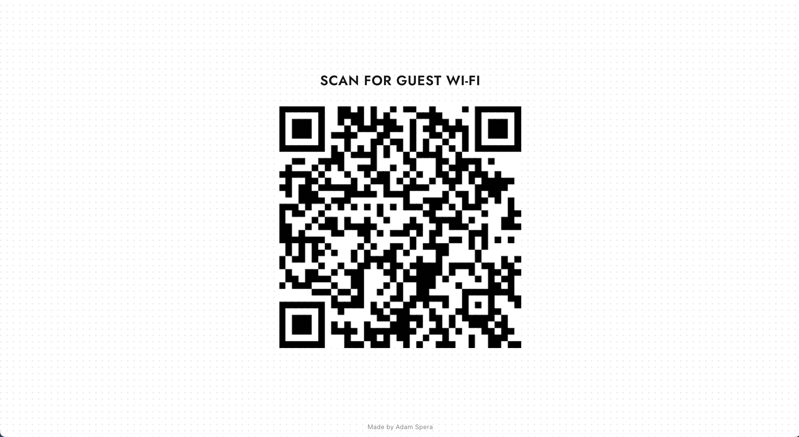

# Meraki Guest Wi-Fi Rotating QR Code with Cloudflare

*Cloudflare: Rotating Guest WiFi QR Code*  
An Open-Source Meraki Guest Wi-Fi Rotating QR Code using Cloudflare Pages.

[](https://developer.cisco.com/codeexchange/github/repo/AdamSpera/meraki-rotating-guestqr-cloudflare)
[](https://developer.cisco.com/codeexchange/devenv/AdamSpera/meraki-rotating-guestqr-cloudflare/)

## Overview

This project is an open-source and freely accessible solution for creating customized Guest Wi-Fi landing pages with Rotating QR Codes tailored to Cisco Meraki wireless networks.

This project's rotating QR Code dynamically updates daily by changing the wifi password, keeping the user pool fresh every day.

Utilizing Cloudflare Pages and the open-source framework of this project, you can effortlessly display your customized Guest Wi-Fi page.

Thanks to Cloudflare's reliable usage models, there are no associated fees, subscription costs, or ongoing maintenance requirements, making this solution equally accessible to individuals, small businesses, and organizations.

### Example



## Installation

### Deploying to Cloudflare

_Prerequisite:_ Create a Cloudflare account www.cloudflare.com.  
_Prerequisite:_ Create a GitHub account www.github.com.  

1. Fork this repository to your GitHub.
2. Rename the forked repo for your desired live page URL.
3. Log in to Cloudflare and navigate to "Workers & Pages" on the sidebar.
4. Click "Create Application," then select the "Pages" tab.
5. Click "Connect to Git" and choose your forked repository.
6. Click "Begin setup" and then "Save and Deploy."
7. Wait about 5 minutes for the initial build.
8. Success! Check it out at ```https://<forked-repo-name>.pages.dev```.

### Configuring The Backend

1. Using VS Code, navigate to the functions directory and enter the getCode.js file.
2. Find the following block of code:
```
    const api_key = '';
    const network_id = '';
    const ssid_number = '';
```
3. Replace the values with your Meraki credentials accordingly.

## Optional: Setup a custom domain name

Setting up a custom domain requires the domain to be added to Cloudflare under the "Websites" tab, as this process will add a new CNAME attribute to the domain's DNS configurations.

Make sure to update the Walled Garden ranges if previously configured! Both the Cloudflare page url and the custom domain name must be added!

1. Select the "Workers & Pages" tab on the sidebar.
2. Select the pages project you want to set up a custom domain for.
3. Select the "Custom domains" tab in the main section.
4. Click the "Setup a custom domain" button.
5. Enter the domain you want to configure as the custom domain name.
6. Click the "Activate Domain" button at the bottom of the page.
7. Success! Check out your new domain in a few minutes at ```https://<custom-domain>```.

## Updating Your Deployment

Updating your deployment is as easy as it comes!  
Simply commit your changes to the repository used to create the page, and Cloudflare will automatically build and deploy the next version for you! This can be altered, though, to only automatically deploy to a preview branch rather than production.

## Created By
*Adam Spera & Brey Rivera*  
Find us at the links below!  
[https://adamspera.dev](https://adamspera.dev/) & [https://breyr.dev](https://breyr.dev/)

## LICENSE
Apache 2.0 (see [LICENSE](./LICENSE)).
